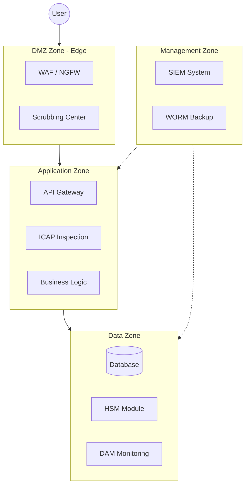

# Customer Service System Security Architecture

    
    
    

---

## Core Principles

A comprehensive security infrastructure project for an individual customer service system, designed for maximum resource isolation and protection of sensitive data. Documentation was prepared using LaTeX.

The project is based on two pillars of modern cybersecurity:

1.  **Defense in Depth** – multi-layered control mechanisms at the network, application, and data levels.
2.  **Zero Trust Network Access (ZTNA)** – elimination of traditional VPN models in favor of identity and context-based authorization.

---

## System Architecture

The infrastructure has been divided into logical isolation zones, as visualized in the diagram below:

---

## Key Control Mechanisms

| Category | Mechanism / Standard | Description |
| :--- | :--- | :--- |
| **Identity** | IdP/IAM, OIDC, MFA | Authorization based on identity and multi-factor authentication. |
| **Cryptography** | mTLS, TLS 1.3, TDE | Encryption of data at rest and in transit. |
| **DevSecOps** | SAST, DAST, Container Scanning | Integration of security testing in the CI/CD pipeline. |
| **Resilience** | Write Once, Read Many (WORM) | Ransomware protection through immutable data copies. |

---

## Author

> [!NOTE]
> **Paweł Murdzek**
> *Security Architecture Specialist*
