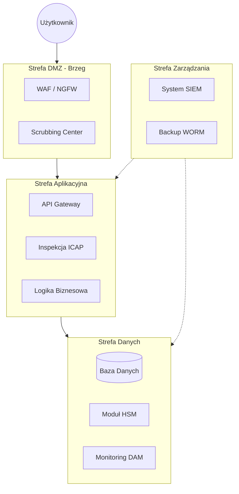

# Architektura Bezpieczeństwa Systemu Obsługi Klienta

    
    
    

---

## Główne Założenia

Kompleksowy projekt infrastruktury bezpieczeństwa dla systemu obsługi klientów indywidualnych, zaprojektowany z myślą o maksymalnej izolacji zasobów i ochronie danych wrażliwych. Dokumentacja została przygotowana w systemie LaTeX.

Projekt opiera się na dwóch filarach nowoczesnego cyberbezpieczeństwa:

1.  **Defense in Depth (Obrona w głębokości)** – wielowarstwowe mechanizmy kontrolne na poziomie sieci, aplikacji i danych.
2.  **Zero Trust Network Access (ZTNA)** – eliminacja tradycyjnych modeli VPN na rzecz autoryzacji opartej na tożsamości i kontekście.

---

## Architektura Systemu

Infrastruktura została podzielona na logiczne strefy izolacji, co wizualizuje poniższy diagram:

---

## Kluczowe Mechanizmy Kontrolne

| Kategoria | Mechanizm / Standard | Opis |
| :--- | :--- | :--- |
| **Tożsamość** | IdP/IAM, OIDC, MFA | Autoryzacja oparta na tożsamości i wieloskładnikowym uwierzytelnianiu. |
| **Kryptografia** | mTLS, TLS 1.3, TDE | Szyfrowanie danych w spoczynku i w locie. |
| **DevSecOps** | SAST, DAST, Container Scanning | Integracja testów bezpieczeństwa w potoku CI/CD. |
| **Odporność** | Write Once, Read Many (WORM) | Ochrona przed ransomware dzięki niezmiennym kopiom danych. |

---

## Autor

> [!NOTE]
> **Paweł Murdzek**
> *Specjalista ds. Architektury Bezpieczeństwa*